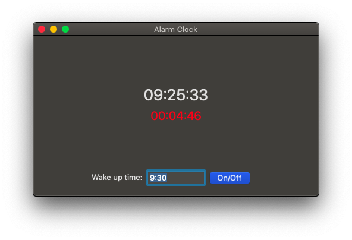
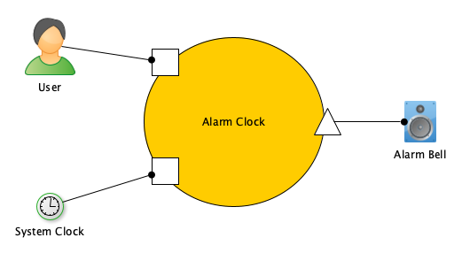
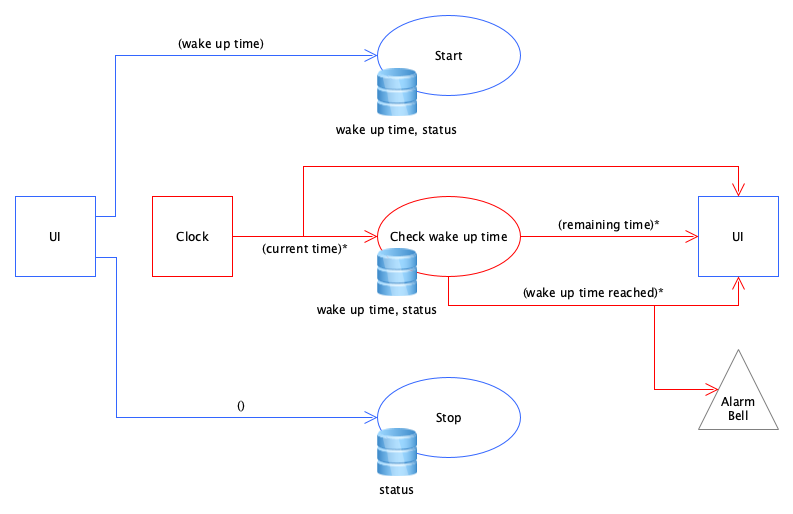

# Alarm Clock

An alarm clock as an application. It displays the current time. If the user set a wake up time, it shows remaining time and sounds an alarm if
wake up time reached.

## Installation

TODO

## Usage

*   The current time is displayed at the top.
*   The alarm time is displayed below.
*   Enter wake up time in the textfield.
*   With the button you can turn on or off the alarm.

## Architecture

There are two actors and and one resource. The actors are the user and the system clock. The resource is the alarm bell.   

### Domain

#### Dialog Alarm Clock

##### System clock tick

*   Update display of current time.
*   Update display of remaining time while alarm is switched on.
*   Check if wake up time has been reached.
*   Sound alarm if wake up time has been reached.
*   Switch off checking for wake up time, if wake up time has been reached.

##### Switch on the alarm

*   Switch on checking for the wake up time.

##### Switch off the alarm

*   Switch off checking for the wake up time.

### Flow

__Legend:__

*   Circle - Functional Unit
*   Rectangle - Portal
*   Triangle - Provider
*   Blue: UI Thread
*   Red: Clock Thread
